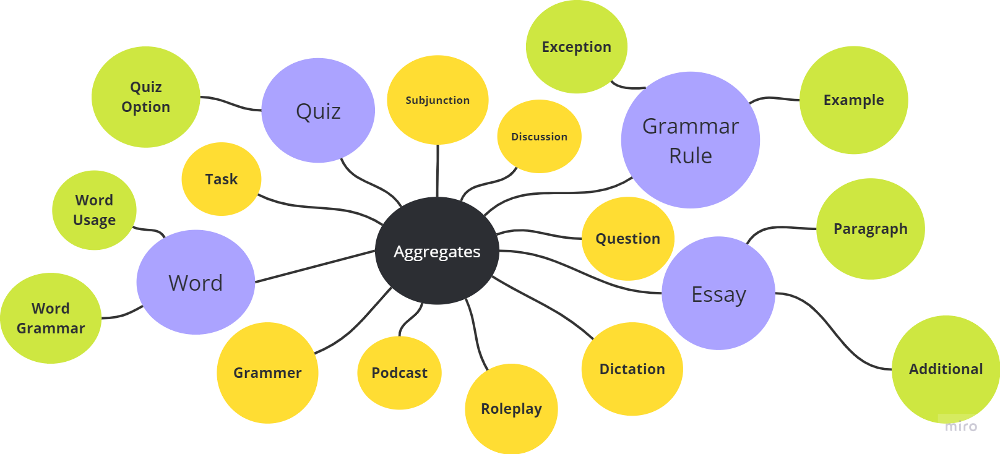

# Norsk API

## Table of contents

- [Norsk API](#norsk-api)
  - [Table of contents](#table-of-contents)
    - [Requirements](#requirements)
    - [Architecture Overview](#architecture-overview)
    - [Setup](#setup)
      - [Step 1: Clone the Repository](#step-1-clone-the-repository)
      - [Step 2: Set Up Database](#step-2-set-up-database)
      - [Step 3: Apply Migrations](#step-3-apply-migrations)
      - [Step 4: Run the Application](#step-4-run-the-application)
      - [Other Commands](#other-commands)
    - [LocalExpressions Endpoints](#localexpressions-endpoints)
    - [Quiz Endpoints](#quiz-endpoints)
    - [Discussion Endpoints](#discussion-endpoints)
    - [Word Endpoints](#word-endpoints)
    - [Question Endpoints](#question-endpoints)
    - [Dictation Endpoints](#dictation-endpoints)
    - [Roleplay Endpoints](#roleplay-endpoints)
    - [Podcast Endpoints](#podcast-endpoints)
    - [Essay Endpoints](#essay-endpoints)
    - [Grammar Topic Endpoints](#grammar-topic-endpoints)
    - [Grammar Rule Endpoints](#grammar-rule-endpoints)
    - [Subjunction Endpoints](#subjunction-endpoints)



This project follows Clean Architecture principles combined with Domain-Driven Design (DDD) to create a maintainable and scalable .NET application.

### Requirements

- [.NET 6 SDK](https://dotnet.microsoft.com/download/dotnet/6.0) or later
- [SQL Server](https://www.microsoft.com/en-us/sql-server/sql-server-downloads) (or any database of your choice)
- [Visual Studio](https://visualstudio.microsoft.com/) or [Visual Studio Code](https://code.visualstudio.com/) (Recommended for development)

### Architecture Overview

This project is structured based on Clean Architecture, with separation into the following main layers:

- **Core** - Contains the Domain layer, including entities, aggregates, value objects, and domain services.
- **Application** - Contains use cases, DTOs, and interfaces.
- **Infrastructure** - Contains the implementations of repositories, data access, and integrations.
- **WebApi** - The entry point for the API, handling requests and responses.

### Setup

####  Step 1: Clone the Repository

```bash
git clone https://github.com/habibulmursaleen/NorskApi
cd NorskApi
```

####  Step 2: Set Up Database
Ensure your SQL Server is running. Update the connection string in appsettings.Development.json located in the WebApi project:
```json
{
  "ConnectionStrings": {
    "DefaultConnection": "Server=localhost;Database=MyDatabase;User Id=your-username;Password=your-password;"
  }
}

```

####  Step 3: Apply Migrations
Navigate to the Infrastructure layer where the DbContext is located and run the following commands to apply migrations:
```bash
dotnet ef migrations add InitialCreate --project src/Infrastructure --startup-project src/WebApi
dotnet ef database update --project src/Infrastructure --startup-project src/WebApi
```

####  Step 4: Run the Application
Navigate to the WebApi project directory and start the API:

```bash
cd src/NorskApi.Api
dotnet run
```
#### Other Commands

```
dotnet test
dotnet watch
dotnet run
dotnet build
```

### LocalExpressions Endpoints

- **POST `{host}/api/v1/localexpressions`**  
  Create a new local expression.

- **PUT `{host}/api/v1/localexpressions/{localexpressionId}`**  
  Update an existing local expression by `localexpressionId`.

- **DELETE `{host}/api/v1/localexpressions/{localexpressionId}`**  
  Delete the local expression by `localexpressionId`.

- **GET `{host}/api/v1/localexpressions`**  
  Retrieve all local expressions available.

- **GET `{host}/api/v1/localexpressions/{localexpressionId}`**  
  Retrieve details of a specific local expression by `exlocalexpressionIdpressionId`.


### Quiz Endpoints

- **POST `{host}/api/v1/level/{b1}/quizes`**  
  Create a new quiz.

- **PUT `{host}/api/v1/level/{b1}/quizes/{quizId}`**  
  Update an existing quiz by `quizId` under the level `{b1}`.

- **DELETE `{host}/api/v1/level/{b1}/quizes/{quizId}`**  
  Delete the quiz by `quizId` under the specified level `{b1}`.

- **GET `{host}/api/v1/level/{b1}/quizes`**  
  Retrieve all quizzes available for the specified level `{b1}`.

- **GET `{host}/api/v1/level/{b1}/quizes/{quizId}`**  
  Retrieve details of a specific quiz by `quizId` under the specified level `{b1}`.

---

### Discussion Endpoints

- **POST `{host}/api/v1/level/{b1}/discussions`**  
  Create a new discussion under the specified level `{b1}`.

- **PUT `{host}/api/v1/level/{b1}/discussions/{discussionId}`**  
  Update an existing discussion by `discussionId` under the specified level `{b1}`.

- **DELETE `{host}/api/v1/level/{b1}/discussions/{discussionId}`**  
  Delete the discussion by `discussionId` under the specified level `{b1}`.

- **GET `{host}/api/v1/level/{b1}/discussions`**  
  Retrieve all discussions available for the specified level `{b1}`.

- **GET `{host}/api/v1/level/{b1}/discussions/{discussionId}`**  
  Retrieve details of a specific discussion by `discussionId` under the specified level `{b1}`.

---

### Word Endpoints

- **POST `{host}/api/v1/level/{b1}/words`**  
  Create a new word entry under the specified level `{b1}`.

- **PUT `{host}/api/v1/level/{b1}/words/{wordId}`**  
  Update an existing word entry by `wordId` under the specified level `{b1}`.

- **DELETE `{host}/api/v1/level/{b1}/words/{wordId}`**  
  Delete the word entry by `wordId` under the specified level `{b1}`.

- **GET `{host}/api/v1/level/{b1}/words`**  
  Retrieve all word entries available for the specified level `{b1}`.

- **GET `{host}/api/v1/level/{b1}/words/{wordId}`**  
  Retrieve details of a specific word entry by `wordId` under the specified level `{b1}`.

---

### Question Endpoints

- **POST `{host}/api/v1/level/{b1}/questions`**  
  Create a new question under the specified level `{b1}`.

- **PUT `{host}/api/v1/level/{b1}/questions/{questionId}`**  
  Update an existing question by `questionId` under the specified level `{b1}`.

- **DELETE `{host}/api/v1/level/{b1}/questions/{questionId}`**  
  Delete the question by `questionId` under the specified level `{b1}`.

- **GET `{host}/api/v1/level/{b1}/questions`**  
  Retrieve all questions available for the specified level `{b1}`.

- **GET `{host}/api/v1/level/{b1}/questions/{questionId}`**  
  Retrieve details of a specific question by `questionId` under the specified level `{b1}`.

---

### Dictation Endpoints

- **POST `{host}/api/v1/level/{b1}/dictations`**  
  Create a new dictation under the specified level `{b1}`.

- **PUT `{host}/api/v1/level/{b1}/dictations/{dictationId}`**  
  Update an existing dictation by `dictationId` under the specified level `{b1}`.

- **DELETE `{host}/api/v1/level/{b1}/dictations/{dictationId}`**  
  Delete the dictation by `dictationId` under the specified level `{b1}`.

- **GET `{host}/api/v1/level/{b1}/dictations`**  
  Retrieve all dictations available for the specified level `{b1}`.

- **GET `{host}/api/v1/level/{b1}/dictations/{dictationId}`**  
  Retrieve details of a specific dictation by `dictationId` under the specified level `{b1}`.

---

### Roleplay Endpoints

- **POST `{host}/api/v1/level/{b1}/roleplays`**  
  Create a new roleplay under the specified level `{b1}`.

- **PUT `{host}/api/v1/level/{b1}/roleplays/{roleplayId}`**  
  Update an existing roleplay by `roleplayId` under the specified level `{b1}`.

- **DELETE `{host}/api/v1/level/{b1}/roleplays/{roleplayId}`**  
  Delete the roleplay by `roleplayId` under the specified level `{b1}`.

- **GET `{host}/api/v1/level/{b1}/roleplays`**  
  Retrieve all roleplays available for the specified level `{b1}`.

- **GET `{host}/api/v1/level/{b1}/roleplays/{roleplayId}`**  
  Retrieve details of a specific roleplay by `roleplayId` under the specified level `{b1}`.

---

### Podcast Endpoints

- **POST `{host}/api/v1/level/{b1}/podcasts`**  
  Create a new podcast entry under the specified level `{b1}`.

- **PUT `{host}/api/v1/level/{b1}/podcasts/{podcastId}`**  
  Update an existing podcast entry by `podcastId` under the specified level `{b1}`.

- **DELETE `{host}/api/v1/level/{b1}/podcasts/{podcastId}`**  
  Delete the podcast entry by `podcastId` under the specified level `{b1}`.

- **GET `{host}/api/v1/level/{b1}/podcasts`**  
  Retrieve all podcast entries available for the specified level `{b1}`.

- **GET `{host}/api/v1/level/{b1}/podcasts/{podcastId}`**  
  Retrieve details of a specific podcast entry by `podcastId` under the specified level `{b1}`.

---

### Essay Endpoints

- **POST `{host}/api/v1/level/{b1}/conversation/essays`**  
  Create a new essay under the specified level `{b1}`.

- **PUT `{host}/api/v1/level/{b1}/conversation/essays/{essayId}`**  
  Update an existing essay by `essayId` under the specified level `{b1}`.

- **DELETE `{host}/api/v1/level/{b1}/conversation/essays/{essayId}`**  
  Delete the essay by `essayId` under the specified level `{b1}`.

- **GET `{host}/api/v1/level/{b1}/conversation/essays`**  
  Retrieve all essays available for the specified level `{b1}`.

- **GET `{host}/api/v1/level/{b1}/conversation/essays/{essayId}`**  
  Retrieve details of a specific essay by `essayId` under the specified level `{b1}`.

---

### Grammar Topic Endpoints

- **POST `{host}/api/v1/level/{b1}/grammars/topics`**  
  Create a new grammar topic under the specified level `{b1}`.

- **PUT `{host}/api/v1/level/{b1}/grammars/topics/{topicId}`**  
  Update an existing grammar topic by `topicId` under the specified level `{b1}`.

- **DELETE `{host}/api/v1/level/{b1}/grammars/topics/{topicId}`**  
  Delete the grammar topic by `topicId` under the specified level `{b1}`.

- **GET `{host}/api/v1/level/{b1}/grammars/topics`**  
  Retrieve all grammar topics available for the specified level `{b1}`.

- **GET `{host}/api/v1/level/{b1}/grammars/topics/{topicId}`**  
  Retrieve details of a specific grammar topic by `topicId` under the specified level `{b1}`.

---

### Grammar Rule Endpoints

- **POST `{host}/api/v1/level/{b1}/grammars/rules`**  
  Create a new grammar rule under the specified level `{b1}`.

- **PUT `{host}/api/v1/level/{b1}/grammars/rules/{ruleId}`**  
  Update an existing grammar rule by `ruleId` under the specified level `{b1}`.

- **DELETE `{host}/api/v1/level/{b1}/grammars/rules/{ruleId}`**  
  Delete the grammar rule by `ruleId` under the specified level `{b1}`.

- **GET `{host}/api/v1/level/{b1}/grammars/rules`**  
  Retrieve all grammar rules available for the specified level `{b

1}`.

- **GET `{host}/api/v1/level/{b1}/grammars/rules/{ruleId}`**  
  Retrieve details of a specific grammar rule by `ruleId` under the specified level `{b1}`.

---

### Subjunction Endpoints

- **GET `{host}/api/v1/level/{b1}/subjunctions`**  
  Retrieve a list of subjunctions categorized by type such as time, cause, condition, and contrast for the specified level `{b1}`.

---

These are the main endpoints for the Norsk learning platform, grouped by type. They cover common CRUD (Create, Read, Update, Delete) actions and allow you to manage quizzes, discussions, words, questions, dictations, roleplays, podcasts, essays, grammar topics, grammar rules, and subjunctions.