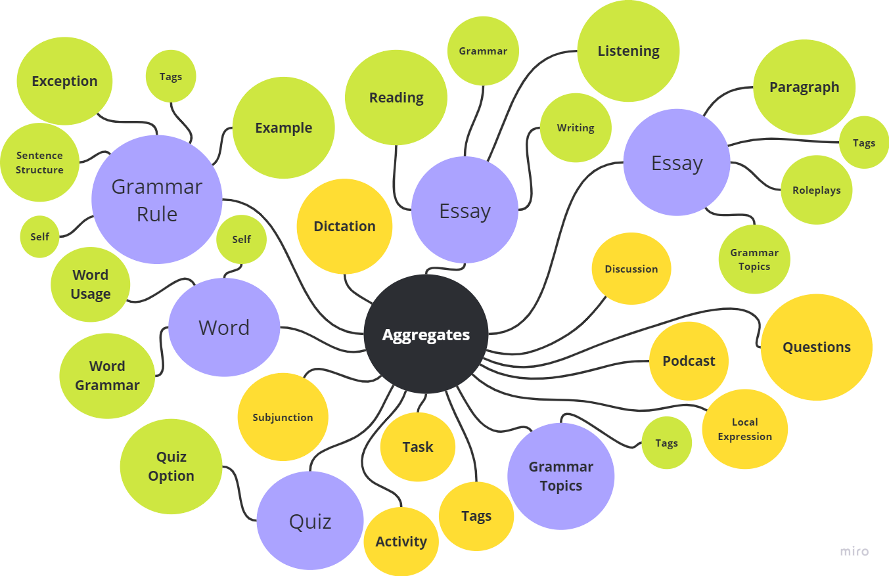

# Norsk API

A comprehensive backend service for norsk learning application. 

## Table of contents

- [Norsk API](#norsk-api)
  - [Table of contents](#table-of-contents)
    - [Requirements](#requirements)
    - [Architecture Overview](#architecture-overview)
    - [Setup](#setup)
      - [Step 1: Clone the Repository](#step-1-clone-the-repository)
      - [Step 2: Restore NuGet Packages](#step-2-restore-nuget-packages)
      - [Step 3: Set Up Docker and Database](#step-3-set-up-docker-and-database)
      - [Step 3: Apply Migrations](#step-3-apply-migrations)
      - [Step 4: Build and Run the Application](#step-4-build-and-run-the-application)
      - [Test](#test)
  - [Endpoints](#endpoints)
      - [Subjunction Endpoint](#subjunction-endpoint)
      - [LocalExpression Endpoint](#localexpression-endpoint)
      - [Tag Endpoint](#tag-endpoint)
      - [Activity Endpoint](#activity-endpoint)
      - [Essay Endpoint](#essay-endpoint)
      - [Dictation Endpoint](#dictation-endpoint)
      - [Podcast Endpoint](#podcast-endpoint)
      - [Question](#question)
      - [Discussion Endpoint](#discussion-endpoint)
      - [Word Endpoint](#word-endpoint)
      - [Grammar Topic Endpoint](#grammar-topic-endpoint)
      - [Grammar Rule Endpoint](#grammar-rule-endpoint)
      - [Tasks Endpoint](#tasks-endpoint)
      - [Quiz Endpoint](#quiz-endpoint)
      - [Norskprove Endpoint](#norskprove-endpoint)



This project follows Clean Architecture principles combined with Domain-Driven Design (DDD) to create a maintainable and scalable .net 9application.

### Requirements

- [.net 9 SDK](https://dotnet.microsoft.com/en-us/download/dotnet/9.0) or later
- [SQL Server](https://www.microsoft.com/en-us/sql-server/sql-server-downloads) (or any database of your choice)
- [Visual Studio](https://visualstudio.microsoft.com/) or [Visual Studio Code](https://code.visualstudio.com/) (Recommended for development)
- [Docker](https://www.docker.com/) (Recommended for Database)

### Architecture Overview

This project is structured based on Clean Architecture, with separation into the following main layers:

- **Core** - Contains the Domain layer, including entities, aggregates, value objects, and domain services.
- **Application** - Contains use cases, DTOs, and interfaces.
- **Infrastructure** - Contains the implementations of repositories, data access, and integrations.
- **WebApi** - The entry point for the API, handling requests and responses.

### Setup

####  Step 1: Clone the Repository

```bash
git clone https://github.com/habibulmursaleen/NorskApi
cd NorskApi
```

####  Step 2: Restore NuGet Packages
Run the following command to restore the necessary NuGet packages:

```bash
dotnet clean
dotnet restore
```

####  Step 3: Set Up Docker and Database
Ensure your SQL Server is running. Update the connection string in appsettings.Development.json located in the Api project:
```json
{
  "ConnectionStrings": {
    "DefaultConnection": "Server=localhost;Database=Norskapi;User Id=yourusername;Password='yourpassword';Encrypt=false;Pooling=true;Min Pool Size=10;Max Pool Size=200;Connection Lifetime=180;Connection Timeout=30;Encrypt=false;"
  }
}
```
Go to the root of the folder and run - (if you already setup the Docker in your pc, you can skip this)

```bash
docker network create mssqlnetwork 
docker compose up
```

####  Step 3: Apply Migrations

Navigate to the Infrastructure layer where the DbContext is located and run the following commands to apply migrations:
```bash
dotnet ef migrations add Init -p src/NorskApi.Infrastructure -s src/NorskApi.Api; 
```

To add a new migration, run the following command:

```bash
dotnet ef migrations add MigrationName -p src/NorskApi.Infrastructure -s src/NorskApi.Api; 
```

Use the following command to apply the existing migrations and update the database:

```bash
dotnet ef database update -p src/NorskApi.Infrastructure -s src/NorskApi.Api;
```
To remove the last migration, use:

```bash
dotnet ef migrations remove -p src/NorskApi.Infrastructure -s src/NorskApi.Api;
```

####  Step 4: Build and Run the Application

Navigate to the root of project directory and start the API:

```bash
dotnet clean
dotnet restore
dotnet build
dotnet watch run --project src/NorskApi.Api 
```

Open your brower and go to http://localhost:5160/swagger/index.html.

#### Test

```
dotnet test
```

## Endpoints 

These are the main endpoints for the Norsk learning platform, grouped by type. They cover common CRUD (Create, Read, Update, Delete) actions and allow you to manage, localExpressions, quizzes, discussions, words, questions, dictations, roleplays, podcasts, essays, grammar topics, grammar rules, and subjunctions.

#### Subjunction Endpoint

- GET `{host}/api/v2/subjunctions`  
---

#### LocalExpression Endpoint

- GET - POST `{host}/api/v2/localexpressions` 
- GET - PUT - DELETE `{host}/api/v2/localexpressions/{id}`  
---

#### Tag Endpoint

- POST GET `{host}/api/v2/tags`
- GET PUT DELETE `{host}/api/v2/tags/{id}`
- Query params `Filters by difficultyLevel`
---

#### Activity Endpoint

- POST GET `{host}/api/v2/activity`
- GET PUT DELETE `{host}/api/v2/activity/{id}`
 ---

#### Essay Endpoint

- GET - POST `{host}/api/v2/essays`
- GET - PUT - DELETE `{host}/api/v2/essays/{id}`
---

#### Dictation Endpoint

- POST GET `{host}/api/v2/dictations`
- GET PUT DELETE `{host}/api/v2/dictations/{id}`
- Query params `Filters by difficultyLevel & essayId`
---

#### Podcast Endpoint
- POST GET `{host}/api/v2/podcasts`
- GET PUT DELETE `{host}/api/v2/podcasts/{id}`
- Query params `Filters by by difficultyLevel & essayId`
---

#### Question

- POST GET `{host}/api/v2/questions`
- GET PUT DELETE `{host}/api/v1/questions/{id}`
- Query params `Filters by by difficultyLevel & essayId`

---

#### Discussion Endpoint

- POST GET `{host}/api/v2/essays/{essayId}/discussions`
- GET `{host}/api/v2/essays/all/discussions`
- GET PUT DELETE `{host}/api/v2/essays/{essayId}/discussions/{id}`
- Query params `Filters by difficultyLevel & EssayId`
---

#### Word Endpoint

- GET - POST `{host}/api/v2/words`
- GET - PUT - DELETE `{host}/api/v2/words/{id}`
- Query params `difficultyLevel & essayId`
---

#### Grammar Topic Endpoint

- GET - POST `{host}/api/v2/grammarsTopics`
- GET - PUT - DELETE `{host}/api/v2/grammarsTopics/{id}`
---

#### Grammar Rule Endpoint

- POST PUT DELETE GET `{host}/api/v2/grammarsTopics/{topicId}/rules`
- POST PUT DELETE GET `{host}/api/v2/grammarsTopics/all/rules`
- GET `{host}/api/v2/grammarsTopics/{topicId}/rules/{id}`
---

#### Tasks Endpoint
- POST PUT DELETE GET `{host}/api/v2/tasks`
- GET `{host}/api/v2/tasks/{id}`
---

#### Quiz Endpoint

- GET - POST `{host}/api/v2/quizzes`
- GET - PUT - DELETE `{host}/api/v2/quizzes/{id}`
- Query params `difficultyLevel & essayId & topicId`
---

#### Norskprove Endpoint

- GET - POST `{host}/api/v2/norskprove`
- GET - PUT - DELETE `{host}/api/v2/norskprove/{id}`
- Query params `difficultyLevel`
---


